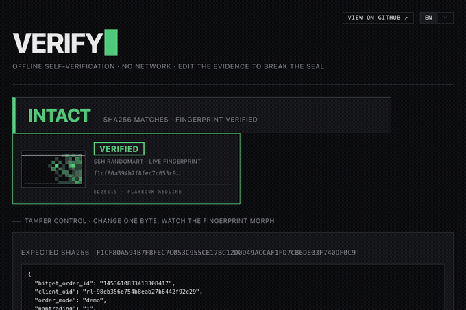

# Playbook Redline

> No AI-edited strategy reaches Bitget until it survives a fixed crash-test suite.
> Every verdict is a signed, tamper-evident receipt you can verify offline, with no server. *No proof, no verdict.*

[English](README.md) · [中文](README_CN.md)


**Live demo** (no install, no login): <https://beautifulrem.github.io/playbook-redline/>

Playbook Redline is a pre-release control gate for AI-edited trading strategies. When an AI rewrites a trading playbook, Redline does not trust the diff. It replays the edited strategy against a fixed crash-test suite, writes the verdict into a hash-chained ed25519 receipt, and places a real Bitget demo order only after the suite passes. Edits that fail are withheld before they can trade.

<p align="center">
  
</p>
<p align="center"><sub>Offline, pure-JS tamper check. Flip one byte in the receipt and the randomart seal voids, the verdict flips to <b>INTEGRITY FAIL</b>, and the proof shows Bitget was never called.</sub></p>

## Verify it yourself

A 60-second zero-secret judge review, offline, with no server and no Bitget credentials. Every step is captured under [`submission-evidence/`](submission-evidence/) and re-runnable from a fresh clone. This path is demo-only, uses evidence from Bitget `paptrading: 1`, and is not an official Bitget Playbook release.

```bash
uv run redline verify-chain artifacts/release-demo/current/service/releases/release-demo-good --json  # passing chained release
bash scripts/tamper-demo.sh                                                                            # flip one byte, integrity fails closed -> exit 4
open artifacts/release-demo/current/evidence.html                                                      # the read-only judge evidence page
```

`verify-chain` reports a passing chained release, the tamper demo exits non-zero after a modified bundle fails verification, and the HTML page is the read-only judge evidence view. This review path does not require Bitget demo credentials; they are only needed to rerun `scripts/release-demo.sh` and mint new demo orders.

The real demo order `1453610833413308417` ran on Bitget `paptrading: 1`, demo-only, with no mainnet access and no secrets ([`submission-evidence/05-real-bitget-order.json`](submission-evidence/05-real-bitget-order.json)).

## How it works

1. An AI edits a trading playbook. That edited candidate is what Redline checks, not the prose of the diff.
2. Redline replays the candidate against a **fixed** crash-test suite: max drawdown, crash-window no-entry, and a trade budget. The suite is fixed on purpose, so the AI cannot move its own goalposts after editing its strategy.
3. On FAIL, the candidate is withheld. No order is placed.
4. On PASS, the verdict is written into a hash-chained, ed25519-signed receipt, and one real Bitget demo order is placed under `paptrading: 1`.
5. Anyone can re-verify the receipt offline. Change one byte and the chain breaks, the signature fails, and the seal voids.

## Integration

Redline sits between an AI that edits a strategy and the exchange. Three ways to wire it in.

### CLI in CI

Gate a pipeline on the edit itself. `redline run` exits non-zero when a candidate is withheld, so a CI step fails the build before a bad edit can ship. The repo doubles as a composite GitHub Action:

```yaml
# .github/workflows/redline.yml
jobs:
  gate:
    runs-on: ubuntu-latest
    steps:
      - uses: actions/checkout@v4
      - uses: beautifulrem/playbook-redline@main
        with:
          package: fixtures/demo_pack
          candidate: candidate_good            # your edited release candidate
          # allow-amber-baseline-genesis: "true"   # only for the bundled genesis demo
```

The action runs `redline doctor` and `redline run`, uploads the receipt / report / proof artifacts, and enforces the verdict. Or call the CLI directly and gate on the exit code:

```bash
uv run redline run "$PKG" --baseline baseline --candidate "$EDIT" \
  --suite fixtures/suites/demo_suite.json --spec fixtures/specs/redline_spec.json \
  --out artifacts/ci --json
uv run redline verify-release-bundle "$BUNDLE" --json   # re-check the sealed bundle before you ship
```

The exit code is the contract: `0` is PASS, a non-zero block code is any withheld or tampered result (for example `4` for an integrity failure), and `10` is the amber `BASELINE_GENESIS` state (a baseline with no prior receipt). `make verify-demo` runs the full bad-edit-withheld then good-edit-passes flow end to end.

### HTTP service

Drive the same kernel from an orchestrator. The service is a thin FastAPI boundary: it does not shell out to the CLI and does not open a second verdict path (workers call `run_redline` and keep each run's artifacts in an isolated directory).

```bash
REDLINE_SERVICE_TOKEN=redline-demo uv run redline-api
```

```bash
H='-H x-redline-token:redline-demo -H content-type:application/json'

curl -s -H x-redline-token:redline-demo http://127.0.0.1:8080/health
curl -s -X POST $H http://127.0.0.1:8080/v1/packages/import -d '{"package_path":"fixtures/demo_pack"}'

RUN=$(curl -s -X POST $H http://127.0.0.1:8080/v1/runs \
  -d '{"package_path":"fixtures/demo_pack","candidate":"candidate_good"}' | jq -r .run_id)
curl -s -H x-redline-token:redline-demo "http://127.0.0.1:8080/v1/runs/$RUN"     # poll the verdict

curl -s -X POST $H "http://127.0.0.1:8080/v1/runs/$RUN/execute"                  # the gate
```

`POST /v1/runs/{run_id}/execute` is the execution gate: it consumes a replayed, chained, signed `PASS` receipt and places one Bitget demo order under `paptrading: 1`. WITHHELD, hash-only, unsigned, unchained, tampered, missing-credential, and default-mainnet cases all return `blocked` before any order call. The release backend layers versioned releases, simulation evidence, risk-policy binding, human approval, and a hash-verified evidence bundle on top, and `/v1/judge/console` renders a read-only review surface. The OpenAPI contract is checked in at `schemas/service-openapi.json`; full endpoint semantics are in [`SERVICE_API.md`](SERVICE_API.md), and deployment is in [`DEPLOYMENT.md`](DEPLOYMENT.md).

### MCP server (from an agent)

Redline ships a narrow [MCP](https://modelcontextprotocol.io) server so an AI agent can verify a receipt mid-conversation. It registers exactly one **read-only** tool and never runs verdict logic for the caller, so an agent can check a result but cannot move it: there is no way to turn a WITHHELD into a PASS through the tool.

Run it over stdio:

```bash
uv run redline-mcp
```

Register it with any MCP client (Claude Desktop, an agent runtime, an IDE):

```json
{
  "mcpServers": {
    "playbook-redline": {
      "command": "uv",
      "args": ["run", "--directory", "/path/to/playbook-redline", "redline-mcp"]
    }
  }
}
```

The one tool, **`redline_check_receipt`**, verifies a receipt without mutating any package or platform state:

- `receipt_path` (required): the receipt to check.
- `pkg_path` (optional): when given, Redline **replays** the package to re-derive the verdict; without it the check is hash-only (integrity, not a verdict).
- returns `status`, `reason_code`, `receipt_hash`, `chain_status`, and `proof_coverage` (schema `redline.mcp.check.v1`).

A typical agent loop: the agent edits a playbook, runs the gate (CLI or `POST /v1/runs`), then calls `redline_check_receipt` on the resulting receipt before it trusts the PASS or ships anything downstream. The verdict path stays out of the agent's reach by construction.

## Install

Prerequisites: Python 3.12 and [uv](https://docs.astral.sh/uv/) (or `pip install -e .`).

```bash
make install
make audit
uv run redline doctor --json
make goldens-check
```

Expected demo outcomes:

- `candidate_good`: `pass` with `BASELINE_GENESIS`
- `candidate_bad`: `withheld` with `NEW_BLOCK_BREACH`

The bundled suite is two 24-bar BTCUSDT windows and three blocking probes (max drawdown, crash-window no-entry, trade budget). `BASELINE_GENESIS` exits with code `10` as an amber state, because the fixture baseline is not chained to a previous receipt. Hash-only checks are integrity-only and return `unverified_no_verdict`; trusted verification uses package-bound replay.

## Usage

Run the gate, then verify the receipt:

```bash
uv run redline run fixtures/demo_pack \
  --baseline baseline --candidate candidate_bad \
  --suite fixtures/suites/demo_suite.json \
  --spec fixtures/specs/redline_spec.json \
  --out artifacts/demo/withheld --json

uv run redline verify-proof artifacts/demo/pass/receipt.json \
  --proof-id proof:package_canonical:7bc11572ef15a4a40cdf1856 \
  --package fixtures/demo_pack \
  --suite fixtures/suites/demo_suite.json \
  --spec fixtures/specs/redline_spec.json --json
```

`redline report` without `--verified` renders only an `UNVERIFIED PREVIEW`. A final publish path must use a chained `PASS` receipt plus an ed25519-signed ledger attestation verified against a pinned trust policy; the bundled genesis fixture is not one. Trust-key generation, ledger signing, and the sponsor-adapter publish flow are documented inline in the CLI help and in [`SERVICE_API.md`](SERVICE_API.md).

## Security boundary

Candidate strategies run in a subprocess. On macOS the worker is also wrapped with `sandbox-exec` to deny network access, process forking, and file writes. Inside the worker, Python audit hooks deny sockets, subprocess, fork, exec, filesystem mutation, reads outside the package and runtime allowlist, and `ctypes`/`cffi`. Scenario bars are preloaded by trusted code and are never exposed as readable files to candidate strategies. The verdict path uses only built-in probes, and a separate tripwire rejects network and LLM SDK imports. This is a local proof-kernel sandbox for demo and CI use; production exchange execution should still use the exchange's own runtime sandbox.

## Repository layout

```text
src/redline/      backend package
tests/            backend tests
fixtures/         demo packages, suites, specs
schemas/          exported JSON schemas
artifacts/demo/   checked-in demo receipts and proof artifacts
scripts/          helper verification scripts
SERVICE_API.md    service API contract
DEPLOYMENT.md     container deployment and judge runbook
```

Built for the Bitget AI Hackathon, Trading Infra track. Demo execution uses Bitget `paptrading: 1` only and does not imply Playbook live activation.

## License

[MIT](LICENSE) © 2026 Playbook Redline contributors.
